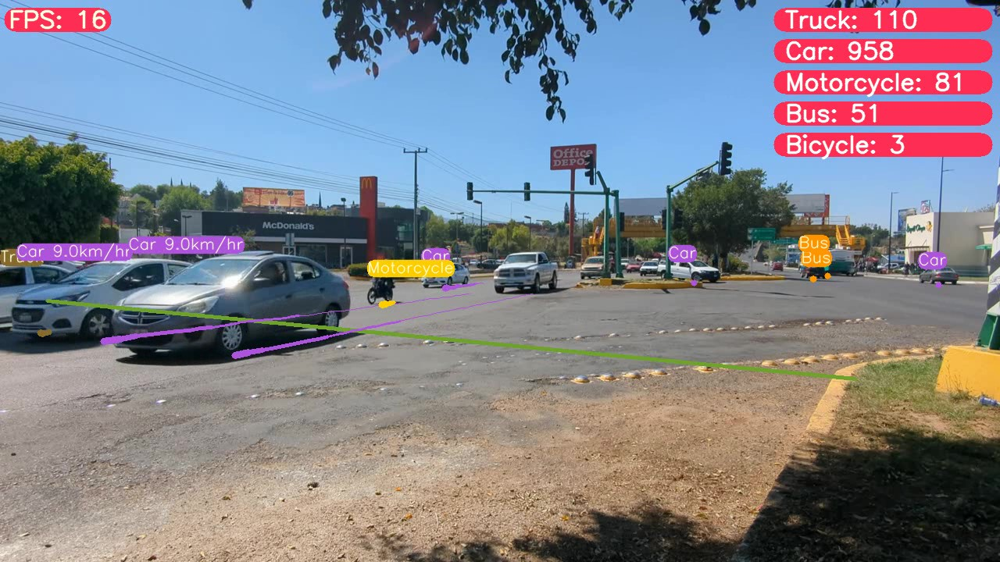

# Morel-IA_Vehicle_Counting (Vehicle Counting and Traffic Analysis in Morelia, Michoacán) 🚗

## Researchers 🧑‍🔬
- *Dr. José A. Guzmán-Torres*  
jose.alberto.guzman@umich.mx  
https://orcid.org/0000-0002-9309-9390

- *Dr. Francisco J. Domínguez-Mota*  
francisco.mota@umich.mx  
https://orcid.org/0000-0001-6837-172X

- *Dr. Gerardo Tinoco-Guerrero*  
gerardo.tinoco@umich.mx  
https://orcid.org/0000-0003-3119-770X

- *Dra. Elia Mercedes Alonso Guzmán*  
elia.alonso@umich.mx  
https://orcid.org/0000-0002-8502-4313

- *Dr. Wilfrido Martínez Molina*  
wilfrido.martinez@umich.mx  
https://orcid.org/0000-0002-3301-4949

*Universidad Michoacana de San Nicolás de Hidalgo, Faculty of Civil Engineering*  
*AULA-CIMNE, Morelia, Michoacán, México*  
*Researchers National System México*

## Description: 📝
This repository contains data from the **Morel-IA** project, which focuses on vehicle counting and traffic analysis in the city of Morelia, Michoacán. The dataset was collected using advanced object detection algorithms, specifically the YOLO family of models, to monitor and analyze vehicle traffic in real-time across various strategic locations in the city.

## Project summary, description, or abstract: 📚
The primary goal of the **Morel-IA** project is to revolutionize traffic management in Morelia by providing precise and continuous data on vehicle flow. The data collected serves to improve urban planning, optimize traffic infrastructure, and enhance road safety by providing actionable insights based on real-time traffic patterns. The dataset not only includes vehicle counts but also offers detailed information on vehicle types, speeds, and movement directions, making it a comprehensive tool for traffic analysis and decision-making.

# The dataset includes the following columns: 🔥
- Vehicle ID  
- Timestamp  
- Location (Monitoring Station)  
- Vehicle Type (Car, Truck, Motorcycle, etc.)  
- Speed (km/h)  
- Direction (Inbound/Outbound)  
- Lane Number  

Each row represents a vehicle detected at a specific monitoring station, with data captured at various times and locations across Morelia.

# This dataset can aid the urban planning and traffic management field in several ways: ✨
- **Traffic Flow Analysis**: This dataset allows researchers and urban planners to study traffic patterns, identify congestion points, and propose solutions for improved traffic flow in urban areas.
- **Safety Enhancements**: By analyzing vehicle speeds and directions, the dataset can be used to identify high-risk areas and inform road safety improvements.
- **Infrastructure Planning**: The data supports the development of new road infrastructures, optimization of traffic signals, and better allocation of resources for road maintenance.

## Description of files: ✍️
The repository contains multiple CSV files in the `data/` directory:
- **raw/**: Raw data files with initial vehicle counts and details for each monitoring station and date.
- **processed/**: Processed data files ready for analysis, including additional computed fields such as average speed and traffic density.

## Repository structure 🔥
Morel-IA_Vehicle_Counting/  
|  
├── README.md  
├── data/  
│   ├── raw/  
│   │   ├── MS1_Calzada_La_Huerta_YYYY-MM-DD.csv  
│   │   ├── MS2_Camelinas_Avenue_YYYY-MM-DD.csv  

Please cite the following paper if you use this dataset in your research:

@article{guzman2024morelia,  
  title = {Morel-IA: An AI-Based Approach for Traffic Management and Vehicle Counting in Morelia, Michoacán},  
  author={Guzmán-Torres, José A and Domínguez-Mota, Francisco J and Alonso-Guzmán, Elia M and Tinoco-Guerrero, Gerardo and Martínez-Molina, Wilfrido},  
  journal = {Data in Brief},  
  volume = {53},  
  pages = {110220},  
  year = {2024},  
  publisher={Elsevier},  
  doi = {https://doi.org/10.1016/j.dib.2024.110220 },  
    URL = {https://github.com/JaGuzmanT/Morel-IA_Vehicle_Counting },  
}  
Git-Hub DOI: 10.5281/zenodo.10553471  
Enjoy and drive safe!
